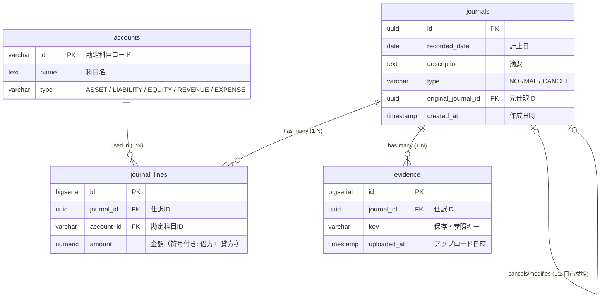

# journal-app

システム概要: [docs/SYSTEM_OVERVIEW.md](docs/SYSTEM_OVERVIEW.md)

# ER



# Infrastructure


# Local Development

## 前提

- Docker / Docker Compose
- Node.js

## セットアップ手順

### 1. リポジトリクローン

```bash
git clone https://github.com/akihirotakeda1111/journal-app.git
```

### 2. 環境変数の設定

ルートディレクトリに.envを作成する。

```bash
cd journal-app
copy .env.example .env
```

### 3. Docker(backend, frontend, db)の起動

```bash
cd journal-app
docker compose up -d
```

## URL

- frontend: http://localhost:5173/
- backend: http://localhost:8000/api/

# Deployment

## backend

### migrate

```bash
ssh ec2-user@[EC2 Public DNS]
cd journal-app
docker-compose exec backend python manage.py makemigrations
docker-compose exec backend python manage.py migrate
docker-compose exec backend python manage.py loaddata account.json
```

### deploy

```bash
ssh ec2-user@[EC2 Public DNS]
cd journal-app
git pull origin main
docker-compose -f docker-compose.dev.yml up -d --build backend
```

## frontend

### deploy

```bash
cd journal-app
git fetch origin
git reset --hard origin/main
cd frontend
sed -i 's|http://[^"]*|https://api.journal-app.a-t-dev.com/api/|' src/utils/api/client.ts
npm run build
aws s3 sync dist/ s3://journal-app-react-s3-bucket --delete --region ap-northeast-1
```

## infra

### apply

```bash
cd journal-app/infra
terraform apply
```

### destroy

```bash
cd journal-app/infra
terraform destroy
```
